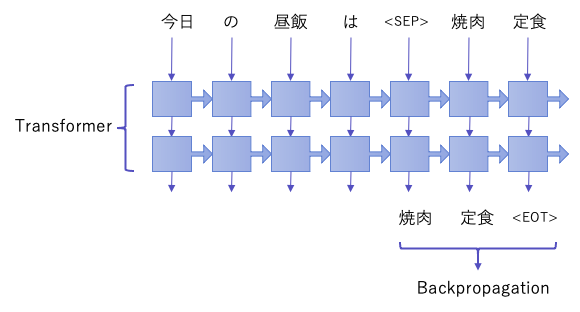

# text2text-japanese
Text2text Conversion Model

このプロジェクトは、[スポンサーを募集しています](https://github.com/tanreinama/gpt2-japanese/blob/master/report/sponsor.md)。

# text2text-japaneseとは何か？


**基本的に、[gpt2-japanese](https://github.com/tanreinama/gpt2-japanese)のモデルを、文章→文章の変換タスク用にファインチューニングするためのプログラムです。**

[gpt2-japanese](https://github.com/tanreinama/gpt2-japanese)のプレトレーニング済みモデルは教師なし学習による言語モデルですが、それを元に、教師あり学習による文章変換モデルを作成します。

質問回答AI、チャットボット、抽象型要約などに使えます。

### スポンサーシップについて

[report/sponsor.md](https://github.com/tanreinama/gpt2-japanese/blob/master/report/sponsor.md)

### デモンストレーション

[Sakamoto's AI lab](http://ailab.nama.ne.jp/#news2title)

## 仕組み


モデルは、[gpt2-japanese](https://github.com/tanreinama/gpt2-japanese)のtransformerをそのまま利用します。

学習には、入力文章と出力文章の、文章ペアからなるコーパスが必要です。質問回答AIなら質問文と回答文、チャットボットならそれまでの会話文とレスポンス、抽象型要約なら説明文と要約文などです。

学習時には、入力文章と出力文章をセパレートトークンで区切り、出力文章に対応するトークンのみ逆伝播させます。

セパレートトークンは、「<|byte0|>」に対応するトークンを使用します。




推論時には、セパレートトークンまでの文章を入力し、それに続くアウトプットを取り出すことで、文章→文章の変換タスクを実行します。


# 使い方


## 学習


学習用データは、入力文章と出力文章の文章ペアを、<|SEP|>で区切ったテキストファイルを用意します。

1ファイルにつき1文章ペアでファイルを作成し、「train_data/*.txt」に保存してあるものとします。


1. 学習用のファイルを作成します

```sh
$ cat train_data/00.txt
今日の昼飯は<|SEP|>焼肉定食
$ python make_data.py --src_dir train_data --dst_file pairtext --split_tag "<|SEP|>"
```

「--split_tag」に区切り文字を指定し、テキストをエンコードして学習用ファイルを作成します。学習用ファイルは、「--dst_file 」に「_*.pkl」という名前のファイルで作成されます。作成されるファイルの数は、使用するプロセス数です。


2. プレトレーニング済みのgpt2-japaneseモデルを用意します

```sh
$ wget https://www.nama.ne.jp/models/gpt2ja-medium.tar.bz2
$ tar xvfj gpt2ja-medium.tar.bz2
```

[gpt2-japanese](https://github.com/tanreinama/gpt2-japanese)のプロジェクトから、ベースとなるモデルをダウンロードします。


3. 学習を実行します

```sh
$ python training.py --base_model gpt2ja-medium --run_name run1 --dataset "pairtext_*.pkl"
```

学習済みのモデルは、checkpoint以下の、「--run_name」で指定したディレクトリ内に保存されます。


4. 学習オプション

```sh
$ python training.py　--base_model　gpt2ja-medium　--max_train_steps 200000　--max_answer_len 160 --train_type QtoA --run_name run2 --dataset "pairtext_*.pkl"
```

「--max_train_steps」で最大学習回数を指定できます（指定しないとCtrl＋Cで終了するまで学習を続けます）。「--max_answer_len」で出力文章の最大の長さを指定します（デフォルトは160トークンです）。「--train_type」で、学習データの入力と出力の向きを指定出来ます。「QtoA」は、学習データを「入力文章→出力文章」として扱い、「AtoQ」はその逆です。


## 推論


5. 入力文章に対応する出力文章を表示

``` sh
$ python text2text.py --model checkpoint/run1 --context "今日の昼飯は"
```

入力文章は、「--context」で与えます。


6. 推論オプション

``` sh
$ python text2text.py --model checkpoint/run1 --top_k 0 --top_p 0.9 -num_generate 5 --allow_duplicate_line --context "今日の昼飯は"
```


gpt-2によるテキスト生成ではtop_k=40がデフォルトですが、正しく学習されたtext2textモデルは、小さいtop_kの値を使用した方が良い結果になります。

プログラムのデフォルトはtop_k=1です。top_kを1にするとモデルは決定論的に動作します（つまり、同じ入力に対して毎回同じ文章が返されます）。多少のランダムネスを導入したい場合は、tpo_k=0、tpo_p=0.9等とパラメーターを調整します。

「--allow_duplicate_line」は、重複した行を認めます。デフォルトでは、重複した行は自動で削除されます。入力文章がとても長い場合は「--full_sentences」を付けると、複数回のモデル実行に入力文章を分割して、全ての出力文章を繋げて出力します。


## Rouge-F1スコア


学習データと同じ形式で、「valid_data/*.txt」に評価用データが保存してあるものとします。


```sh
$ python make_score.py --model checkpoint/run1 --src_dir valid_data
```

とすると、評価用データに対するRouge-F1スコアが表示されます。「--verbose」オプションを付けると、実際に生成された文章と、正解の文章が表示されます。


## サンプルの学習済みモデル


サンプルとして、[コーパス2020](https://github.com/tanreinama/gpt2-japanese/blob/master/report/corpus.md)から、ニュース記事の本文→タイトルを学習させたモデルを公開しています。簡易的な抽象型要約モデルとしても利用出来ます。

[ダウンロード](https://www.nama.ne.jp/models/news2title-medium.tar.bz2) （[予備URL](http://ailab.nama.ne.jp/models/news2title-medium.tar.bz2)）


7. サンプルのモデルを実行

``` sh
$ wget https://www.nama.ne.jp/models/news2title-medium.tar.bz2
$ tar xvfj news2title-medium.tar.bz2
$ python text2text.py --model news2title-medium --context "text2text-japaneseとは、gpt2-japaneseのモデルを、文章→文章の変換タスク用にファインチューニングするためのプログラムです。gpt2-japaneseのプレトレーニング済みモデルは教師なし学習による言語モデルですが、それを元に、教師あり学習による文章変換モデルを作成します。質問回答AI、チャットボット、抽象型要約などに使えます。"

教師なし学習モデルを元に、文章変換モデルを作成することで、文章変換タスクを作成することができます。
```


サンプルのモデルは、ニュース記事→タイトルなので、別のニュース記事コーパスを評価用データとして検証します。

ここでは[livedoor ニュースコーパス](http://www.rondhuit.com/download.html#ldcc)中の、映画記事の本文→タイトル出力を評価用データとして、Rouge-F1スコアを求めてみます。


8. サンプルのスコアを表示

```sh
$ wget https://www.rondhuit.com/download/ldcc-20140209.tar.gz
$ tar xvfz ldcc-20140209.tar.gz
$ python make_score.py --model news2title-medium --src_dir text/movie-enter --dataset_type livedoor
score = 0.24592845762498508
```

